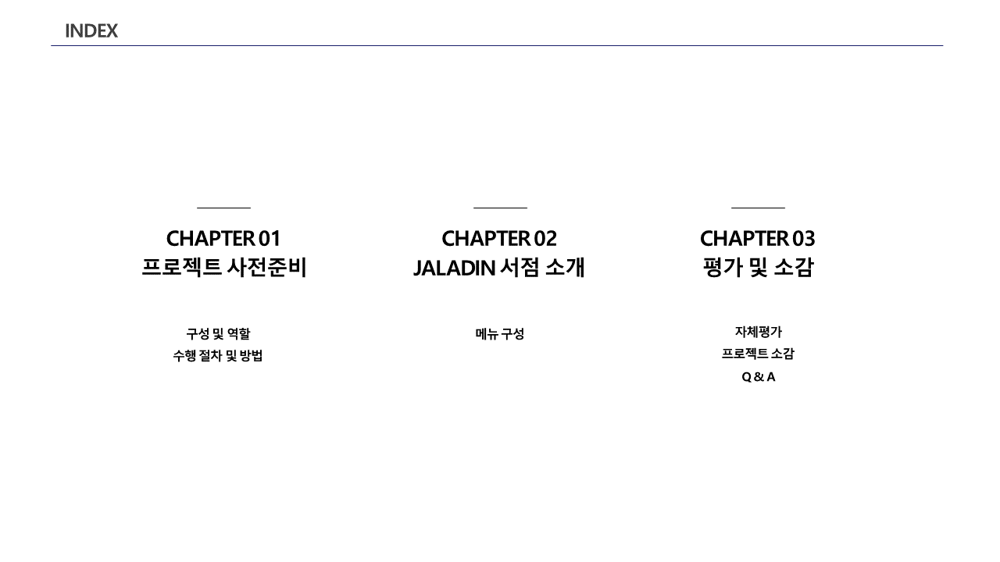
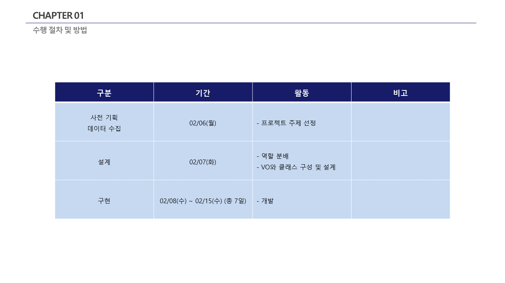
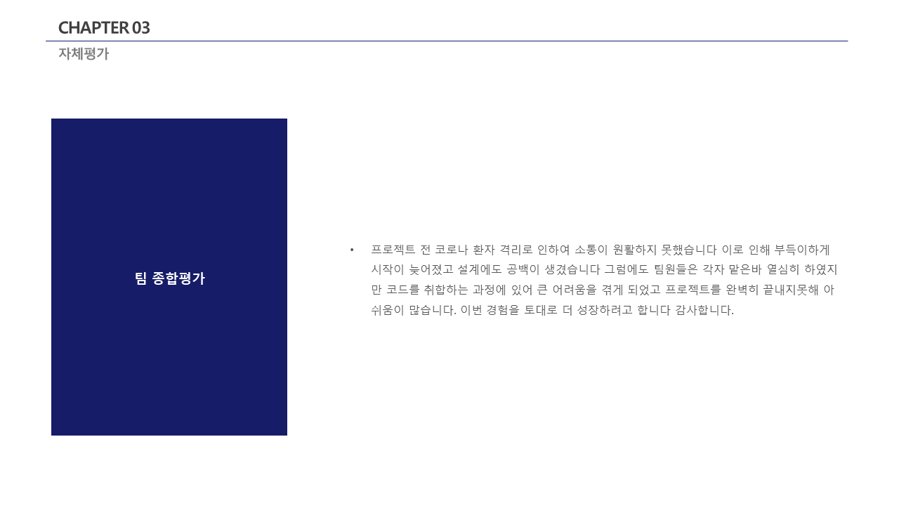
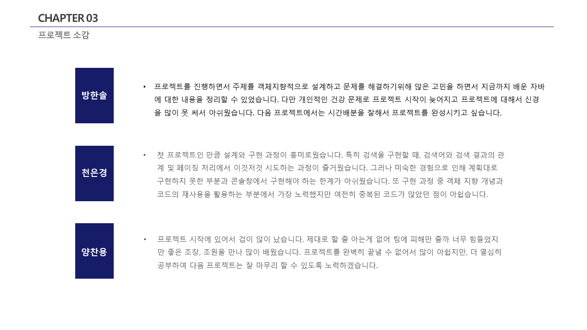

<!-- Improved compatibility of back to top link: See: https://github.com/othneildrew/Best-README-Template/pull/73 -->
<a name="readme-top"></a>
<!--
*** Thanks for checking out the Best-README-Template. If you have a suggestion
*** that would make this better, please fork the repo and create a pull request
*** or simply open an issue with the tag "enhancement".
*** Don't forget to give the project a star!
*** Thanks again! Now go create something AMAZING! :D
-->


<!-- PROJECT SHIELDS -->
<!--
*** I'm using markdown "reference style" links for readability.
*** Reference links are enclosed in brackets [ ] instead of parentheses ( ).
*** See the bottom of this document for the declaration of the reference variables
*** for contributors-url, forks-url, etc. This is an optional, concise syntax you may use.
*** https://www.markdownguide.org/basic-syntax/#reference-style-links
-->

<!-- PROJECT LOGO -->
<br />
<div align="center">
  <a href="#" target="_blank">
    
  </a>

<h3 align="center">JALADIN</h3>

  <p align="center">
    JAVA 콘솔창을 활용한 미니 프로젝트
    <br>
    <p>작업기간 : 2023.02.03~2023.02.16</p>
    vcs worked on svn
    <br>
  </p>
</div>


<!-- TABLE OF CONTENTS -->
<details>
  <summary>Table of Contents</summary>
  <ol>
    <li>
      <a href="#about-the-project">About The Project</a>
      <ul>
        <li><a href="#built-with">Built With</a></li>
      </ul>
    </li>
    <li>
      <a href="#getting-started">Getting Started</a>
      <ul>
        <li><a href="#사전준비">사전준비</a></li>
        <li><a href="#저장소 복제">저장소 복제</a></li>
        <li><a href="#설치">설치</a></li>
      </ul>
    </li>
    <li>
   <a href="#사용방법">사용방법</a>
     <ul>
      <li><a href="#기능소개">기능소개</a></li>
      <li><a href="#더미계정">더미계정</a></li>
      <li><a href="#사용방법">사용방법</a></li>
     </ul>
    </li>
    <li><a href="#요구사항">요구사항</a></li>
    <li><a href="#Collaborator">Collaborator</a></li>
    <li>
       <a href="#Etc">Etc..</a>
       <ul>
          <li><a href="#PPT">PPT</a></li>
          <li><a href="#프로젝트 후기">프로젝트 후기</a></li>
       </ul>
    </li>
    <li><a href="#Contact">Contact</a></li>
    <li>
       <a href="#Acknowledgments">Acknowledgments</a>
       <ul>
          <li><a href="#References">References</a></li>
       </ul>
    </li>
  </ol>
</details>


<!-- ABOUT THE PROJECT -->
## About The Project


<br>
JAVA CLI Project <br>
학원 미니프로젝트 <br>
JAVA 콘솔창을 활용하여 CRUD 구현을 목적으로 작업


### Built With


<p align="right">(<a href="#readme-top">back to top</a>)</p>


<!-- GETTING STARTED -->
## Getting Started

프로젝트를 복제하여 로컬에서 설정하는 방법에 대한 설명 입니다. <br>

### 사전준비

#### 저장소 복제
   ```sh
   git clone https://github.com/yangchanyong/AWS_fullstack_mini_project.git
   ```

### 설치

1. JDK 1.8 / JDK 17.0.5


<p align="right">(<a href="#readme-top">back to top</a>)</p>


<!-- USAGE EXAMPLES -->
## 사용방법
#### 기능소개
<pre>
기능설명
1.   일반 회원 :
    1-1. 회원가입 : id, pw,. 이름, email, 주소, 연락처를 입력하여 회원가입
    1-2. 추천도서 : 관리자가 입력해놓은 추천도서를 확인
    1-3. 도서검색 : 도서명, 작가, ISBN으로 도서 검색 및 주문
    1-4. 장바구니 : 장바구니 상품을 주문 및 삭제
    
2.   출판사  :
    2-1. 회원가입 : id, pw, 이름, 사업자등록번호 13자리를 입력하여 회원가입
    2-2. 상품 등록 요청 : ISBN, 제목, 출판사, 작가명, 설명, 가격, 수량을 입력하여 상품 등록 요청
    2-3. 상품 변경 : ISBN을 입력하여 2-2내용을 수정


3. 관리자
   3-1. 상품 승인: 출판사가 등록 요청한 상품을 isbn을 입력하여 상품을 승인할 수 있다.
   3-2. 추천도서 수정 : isbn을 입력하여 추천도서를 수정
   3-3. 주문 확인 : 일반회원이 주문한 상품을 확인하여 배송
</pre>

#### 더미계정
<pre>
1. 일반회원 :   ycy / 1234
2. 출판사   :   wisdom / 1234
3. 관리자   :   admin / 1234
</pre>

#### 사용방법
<pre>
root/src/team1/BookStoreEx 실행
</pre>

<p align="right">(<a href="#readme-top">back to top</a>)</p>


<!-- ROADMAP -->
## 요구사항

### 작업목록
- [x] 작업완료
- [ ] 작업예정

#### 일반 회원
- [x] 회원가입
    - [x] 일반사용자 회원가입(id, pw, 이름, email, 연락처, 주소)
    - [x] 출판사 회원가입 (id, pw, 이름, 사업자등록번호 13자리)
- [x] 로그인
- [ ] 회원상세조회
- [ ] 회원정보수정
- [ ] 회원탈퇴
- [x] 추천도서
- [x] 도서검색 (1. 도서명, 2. 작가, 3. ISBN)
- [x] 장바구니 (목록, 삭제)
- [x] 책주문
<br>

#### 출판사
- [x] 상품등록
- [x] 상품수정

<br>

#### 관리자
- [x] 상품승인
- [x] 추천도서 수정
- [x] 주문관리

<p align="right">(<a href="#readme-top">back to top</a>)</p>

## Collaborator
Team Project
 <pre>
공통 : 주제선정, 자료조사

방한솔 : <b>조장</b>, 장바구니, 결제, 주문 <a href="https://github.com/hsnachos" target="_blank">GitHub Link</a>

천은경 : 상품크롤링, 상품, 추천도서 <a href="https://github.com/olo02" target="_blank">GitHub Link</a>

양찬용(본인) : 회원 CRUD <a href="https://github.com/yangchanyong" target="_blank">GitHub Link</a>

</pre>

<p align="right">(<a href="#readme-top">back to top</a>)</p>


<!-- LICENSE -->
## Etc
#### PPT

<details>
<summary>PPT Images</summary>











</details>

<br>

### 프로젝트 후기
<pre>
학원 교육과정이 시작하고 약 한달정도 지난 뒤 시작한 프로젝트 입니다.
실력이 부족하여 남들에게 피해를 줄까봐 구현 시작 전 주제선정, 설계단계에서 열심히 자료조사를 하였습니다.
열심히 자료조사를 하고 보고를 한 끝에 제가 올린 '인터넷서점'이 주제에 선정되었습니다.
구현에 많은 어려움이 있었지만 정말 좋은 조장님, 조원분을 만나 싱글톤, 컬렉션 등을 배워 정말 재미있게
프로젝트를 마무리 할 수 있었고, 프로그래밍에 강한 매력을 느끼게 되었습니다.
</pre>


<p align="right">(<a href="#readme-top">back to top</a>)</p>


<!-- CONTACT -->
## Contact

Yang Chanyong - cksdyd93@gmail.com

<a href="https://www.chanyongyang.com" target="_blank">Portfolio Link</a>

<p align="right">(<a href="#readme-top">back to top</a>)</p>


<!-- ACKNOWLEDGMENTS -->
## Acknowledgments

이 프로젝트를 사용해주시고 README를 읽어주신 여러분께 대단히 감사합니다!

### References
README Template : [README-Template](https://github.com/othneildrew/Best-README-Template)<br>
Reference : [알라딘 인터넷서점](https://www.aladin.co.kr/home/welcome.aspx)<br>


<p align="right">(<a href="#readme-top">back to top</a>)</p>

[](https://hits.seeyoufarm.com)
